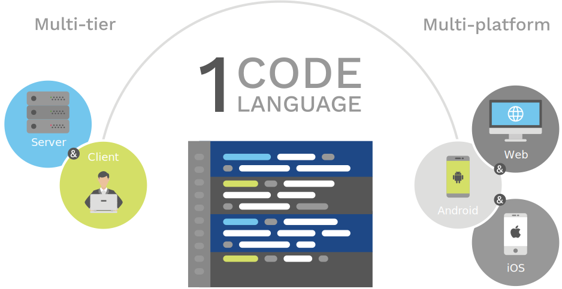

# Multi-tier Programming 
## CPL 2018
### Bob Reynders


<div id='timeline-embed' style="width: 100%; height: 600px"></div>

Note: 
go through important milestones of the web

who:
- makes websites?
- writes html?
- has written php?
- javascript?


### Web Development

- <!-- .element: class="fragment" --> <span class="delight">Generate</span> HTML
- <!-- .element: class="fragment" --> <span class="delight">in</span> Server Lang (e.g., PHP)
- <!-- .element: class="fragment" --> <span class="delight">while using</span> SQL.
- <!-- .element: class="fragment" --> <span class="delight">Write second application in</span> JavaScript
- <!-- .element: class="fragment" --> <span class="delight">beautify with</span> CSS.


<h3 class="right-block-title">Alert <a onclick="window.alert('cpl')">localhost/hello/cpl</a></h3>

<div class="left-block-background">
</div>
<div>
    <div class="left-block">
<h4 class="fragment hide" data-code-focus="1-10">Scala</h4>
<h4 class="fragment hide" data-code-block="2" data-code-focus="1-3">JS</h4>
<h4 class="fragment hide" data-code-focus="2">Grab Name</h4>
<h4 class="fragment hide" data-code-focus="3-6">Setup HTML</h4>
<h4 class="fragment hide" data-code-focus="5">Setup JS</h4>
<h4 class="fragment hide" data-code-block="2" data-code-focus="1-3">Script.js</h4>
<h4 class="fragment hide" data-code-block="2" data-code-focus="2">Alert</h4>
    </div>
    <div class="right-block">
    
<pre>
```val helloWorldService = HttpRoutes.of[IO] {
  case GET -> Root / "hello" / name =>
    Ok(s"""<html><head>
    <script src="script.js"></script></head>
      <body><button onclick="hello($name)">
        Hello</button></body></html>""")
}
```<!-- .element: class="scala" -->
</pre>

<pre>
```function hello(name) {
  window.alert(`Hello ${name}!`);
}
```<!-- .element: class="javascript" -->
</pre>

    </div>
</div>

note:
- what does this program do?
- explain ...
- what is missing?


Design <span class="delight">(CSS)</span>

<!-- .element: class="fragment" --> Database <span class="delight">(SQL)</span>


## <span class="highlight">5</span> languages for an application!
- <!-- .element: class="fragment" --> Complex
- <!-- .element: class="fragment" --> No guarantees
- <!-- .element: class="fragment" --> <span class="highlight">4</span>/10 OWASP top security risks
note:
- owasp top ten is an awareness document for web application security
- 4 of these issues come from problems in the boundary
- in short, the current state of the web is pretty shitty


</img>


## Industry 

- <!-- .element: class="fragment" --> Frameworks
- <!-- .element: class="fragment" --> Libraries
<!-- j -->
  - <!-- .element: class="fragment" --> <span class="delight">Embedded</span> Languages

note:
- things are still being made
- how does industry do this?


## Frameworks

- <!-- .element: class="fragment" --> <span class="delight">Use</span> structure 
- <!-- .element: class="fragment" --> <span class="delight">to promote</span> re-use
- <!-- .element: class="fragment" --> <span class="delight">requires</span> one-size-fits-all
- <!-- .element: class="fragment" --> Ruby on Rails, Django, JSF, ...

note:
- problem with frameworks -> not very flexible, follow one way 
- if problem that does not fit the approach then it's hard to extend


## Libraries & <span class="delight">Embedded</span> Languages

note:
- libraries that add embedded languages or 
- closely resemble language features
- show some examples


<h3 class="right-block-title">Bridge HTML & JavaScript</h3>

<div class="left-block-background">
</div>
<div>
    <div class="left-block">
<h3>VDom</h3>
<h4>React</h4>
    </div>
    <div class="right-block">
<pre>
```class HelloMessage extends React.Component {
  render() {
    return (
      <div>
        Hello {this.props.name}
      </div>
    );
  }
}

ReactDOM.render(
  <HelloMessage name="Taylor"/>,
  mountNode
);
```
</pre>
    </div>
</div>

<span class="fragment" data-code-focus="1-1"></span>
<span class="fragment" data-code-focus="4-6"></span>
<span class="fragment" data-code-focus="12-12"></span>

note:
- react unifies html and javascript 
- create declarative UIs
- create component
- use component as html tag


<h3 class="right-block-title">Bridge Server & Database</h3>

<div class="left-block-background">
</div>
<div>
    <div class="left-block">
<h3>ORM</h3>
<h4>Propel</h4>
    </div>
    <div class="right-block">
<pre><code class="php">$book = new Book();
$book->setTitle("War & Peace");
$book->save();

$author = new Author();
$author->setFirstName("Leo");
$author->setLastName("Tolstoy");
$author->addBook($book);
$author->save();

$author = AuthorQuery::create()->findPk(1);
$books = BookQuery::create()
  ->filterByAuthor($author)
  ->orderByTitle()
  ->find();
</code></pre>
    </div>
</div>

<span class="fragment" data-code-focus="1-9"></span>
<span class="fragment" data-code-focus="11-15"></span>

note:
- object relational mapping 
- PHP
- allow database queries without SQL
- compile to SQL


### A lot more!

- <!-- .element: class="fragment" --> Hot topic: 
  - <!-- .element: class="fragment" --> e.g. "JavaScript Frontend Framework"
  - <!-- .element: class="fragment" --> 18 with at least 1k Github Stars
- <!-- .element: class="fragment" --> <span class="delight">more</span> fragmentation
- <!-- .element: class="fragment" --> even within languages


## <span class="delight">one approach in</span> Academia


### Multi-tier Programming Languages

- <!-- .element: class="fragment" --> <span class="highlight">Unify</span> web technologies
- <!-- .element: class="fragment" --> one language for all tiers
- <!-- .element: class="fragment" --> one environment
- <!-- .element: class="fragment" --> client / server / database


## Multi-tier Programming

- <!-- .element: class="fragment" --> one language
- <!-- .element: class="fragment" --> higher-level abstractions
- <!-- .element: class="fragment" --> analysis across tiers

<!-- .element: class="pos-list" -->

- <!-- .element: class="fragment" --> a lot of work
- <!-- .element: class="fragment" --> no ecosystem

<!-- .element: class="neg-list" -->


- Start from scratch
- <!-- .element: class="fragment" --> Start from existing languages


## Eliom (start from OCaml)


## OCaml crash course

- <!-- .element: class="fragment" --> Cover just the syntax you need
- <!-- .element: class="fragment" --> We'll go fast!


<h3 class="right-block-title">OCaml</h3>

<div class="left-block-background"></div>
<div>
    <div class="left-block">
<h4 class="fragment hide" data-code-focus="1-2">Comment</h4>
<h4 class="fragment hide" data-code-focus="3">Values</h4>
<h4 class="fragment hide" data-code-focus="6">Functions</h4>
<h4 class="fragment hide" data-code-focus="9-16">Labels </h4>
    </div>
    <div class="right-block">
<pre>```
(* values and function 
declarations use "let" keyword. *)
let x = 10

(* + for ints +. for floats *)
let average a b = (a +. b) /. 2.0

(* argument labels *)
let avg ~first:a ~last:b = (a +. b) /. 2.0
avg 10 5
avg ~last:5 ~first:10
```<!-- .element: class="ocaml" --></pre>
    </div>
</div>


<h3 class="right-block-title">OCaml, cont.</h3>

<div class="left-block-background"></div>
<div>
    <div class="left-block">
<h4 class="fragment hide" data-code-focus="2">Lambda</h4>
<h4 class="fragment hide" data-code-focus="5-7">Recursive Functions</h4>
<h4 class="fragment hide" data-code-focus="10-12">Local bindings</h4>
<h4 class="fragment hide" data-code-focus="14-15">Bindings are Vals</h4>
    </div>
    <div class="right-block">
<pre>```
(* anonymous functions *)
List.map (fun x -> x + 1) [1;2;3;4]

(* explicit recursion scoping *)
let rec range a b =
  if a > b then []
  else a :: range (a + 1) b
  
(* local bindings *)
let average a b = 
  let sum = (a +. b) in
  sum /. 2.0

let x = 5
x = 6  (* false, tests equality! *)

```<!-- .element: class="ocaml" --></pre>
    </div>
</div>

Note: test


<h3 class="right-block-title">OCaml, cont.</h3>

<div class="left-block-background"></div>
<div>
    <div class="left-block">
<h4 class="fragment hide" data-code-focus="1">Imports</h4>
<h4 class="fragment hide" data-code-focus="3">Explicit use</h4>
<h4 class="fragment hide" data-code-focus="5-6">Module alias</h4>
    </div>
    <div class="right-block">
<pre>``` open Graphics (* everything from Graphics *)

Graphics.plot (* explicit ref to Graphics *)

module Gr = Graphics (* alias modules *)
Gr.plot (* explicit ref to Graphics *)
```<!-- .element: class="ocaml" --></pre>
    </div>
</div>


- These are the basics
- <!-- .element: class="fragment" --> OCaml has more cool features
- <!-- .element: class="fragment" --> Sadly, out of scope for this talk
- <!-- .element: class="fragment" --> Follow the [guidelines](https://ocaml.org/learn/tutorials/guidelines.html)


# Eliom


</img>


<h3 class="right-block-title">Alert <a onclick="window.alert('cpl')">localhost/hello/cpl</a></h3>

<div class="left-block-background"></div>
<div>
    <div class="left-block">
<h4 class="fragment hide" data-code-focus="1-14">Eliom</h4>
<h4 class="fragment hide" data-code-focus="4-5">Grab name</h4>
<h4 class="fragment hide" data-code-focus="10-14">Write HTML</h4>
<h4 class="fragment hide" data-code-focus="7-9, 13">Write Client Alert</h4>
    </div>
    <div class="right-block">
<pre>```let main_service =
  Hello_app.create
    ~path:(Eliom_service.Path ["hello"])
    ~meth:(Eliom_service.Get (
      Eliom_parameter.(suffix (string "n"))))
    (fun name () ->
      let f = [%client (fun ev ->
        let js_name = Js.string ~%name in
        Dom_html.window##alert js_name)] in
      Lwt.return
        (html
          (head (title (pcdata "Hello")) [])
          (body [button ~a:[a_onclick f] 
                [pcdata "Hello"]])))
```<!-- .element: class="ocaml" --></pre>
    </div>
</div>


## Eliom

<!-- .element: class="fragment" --> <span class="highlight">Checked</span> boundaries


<h3 class="right-block-title">Typed Service Parameters</h3>

<div class="left-block-background"></div>
<div>
    <div class="left-block">
<h4 class="fragment hide" data-code-focus="4-6">Typed params</h4>
    </div>
    <div class="right-block">
<pre>```Eliom_registration.Html.create
    ~path:(Eliom_service.Path ["path"])
    ~meth:
      (Eliom_service.Get
         Eliom_parameter.(int "i" ** 
           (int "ii" ** string "s")))
    f
```<!-- .element: class="ocaml" --></pre>
    </div>
</div>


<h3 class="right-block-title">Checked Links</h3>

<div class="left-block-background"></div>
<div>
    <div class="left-block">
<h4 class="fragment hide" data-code-focus="1, 14">Link directly to service</h4>
    </div>
    <div class="right-block">
<pre>```let linkrec =
  Eliom_service.create
    ~path:(Eliom_service.Path ["linkrec"])
    ~meth:(Eliom_service.Get 
             Eliom_parameter.unit) ()

let _ =
  Eliom_registration.Html.register
    linkrec
    (fun () () ->
       Lwt.return
         (html
            (head (title (pcdata "")) [])
            (body [p [a linkrec 
                        [pcdata "tap"] ()]])))
```<!-- .element: class="ocaml" --></pre>
    </div>
</div>


<h3 class="right-block-title">Sections</h3>

<div class="left-block-background"></div>
<div>
    <div class="left-block">
<h4 class="fragment hide" data-code-focus="1-3, 5-7">Server code</h4>
<h4 class="fragment hide" data-code-focus="1-3, 9-11, 13">Client code</h4>
<h4 class="fragment hide" data-code-focus="13">Shortcut</h4>
<h4 class="fragment hide" data-code-focus="1-3">Duplicate</h4>
    </div>
    <div class="right-block">
<pre>```[%%shared
  let sh = ...
]

[%%server
  let s = ...
]

[%%client
  let c = ...
]

let%client x = 5
```<!-- .element: class="ocaml" --></pre>
    </div>
</div>


<h3 class="right-block-title">Injections & Fragments</h3>

<div class="left-block-background"></div>
<div>
    <div class="left-block">
<h4 class="fragment hide" data-code-focus="1">Server</h4>
<h4 class="fragment hide" data-code-focus="3-4">Inject</h4>
<h4 class="fragment hide" data-code-focus="6-13">Fragment on server</h4>
    </div>
    <div class="right-block">
<pre>```let%server x = 5

(* inject 5 into client *)
let%client give5 = ~%x 

(* fragment *)
let%server f = 
  [%client (fun ev ->
    let js_name = Js.string ~%name in
    Dom_html.window##alert js_name)]
  
let%server alerter =
  button ~a:[a_onclick f] [pcdata "Hello"]
```<!-- .element: class="ocaml" --></pre>
    </div>
</div>


<h3 class="right-block-title"><span class="delight">Typed </span>Html</h3>

<div class="left-block-background"></div>
<div>
    <div class="left-block">
<h4 class="fragment hide" data-code-focus="3-6">Function</h4>
<h4 class="fragment hide" data-code-focus="7-9">Argument</h4>
    </div>
    <div class="right-block">
<pre>```open Eliom_content.Html.D

(* val html : [`Head] elt -> 
              [`Body] elt -> 
              [`Html] elt *)
html
  (head (title (pcdata "Hey")) [])
  (body [ h1 [pcdata "Hello"] ;
          p [pcdata "world"] ])
```<!-- .element: class="ocaml" --></pre>
    </div>
</div>


<h3 class="right-block-title"><span class="highlight">Typed </span>Html</h3>

<div class="left-block-background"></div>
<div>
    <div class="left-block">
<h4 class="fragment hide" data-code-focus="4">Add to head</h4>
<h4 class="fragment hide" data-code-focus="8-16">ERROR</h4>
    </div>
    <div class="right-block">
<pre>```open Eliom_content.Html.D

html
  (head (title (pcdata "Hey")) [pcdata "f"])
  (body [ h1 [pcdata "Hello"] ;
          p [pcdata "world"] ])
          
Error: 
This expression has 
type ([> `PCDATA ] as 'a) Html.elt
but an expression was expected of type
  Html_types.head_content_fun Html.elt
Type 'a is not compatible with ...
[ `Base
| ...
| `Style ]
```<!-- .element: class="ocaml" --></pre>
    </div>
</div>


<h3 class="right-block-title">Client / Server Communication</h3>

<div class="left-block-background"></div>
<div>
    <div class="left-block">
<h4 class="fragment hide" data-code-focus="1-3">Server function</h4>
<h4 class="fragment hide" data-code-focus="5-7">Create client caller</h4>
<h4 class="fragment hide" data-code-focus="9-15">Call log</h4>
    </div>
    <div class="right-block">
<pre>```(* returns 'a Lwt.t' *)
let%server log str = 
  Lwt_io.write_line Lwt_io.stdout str

let%client log =
  ~%(Eliom_client.server_function
       [%derive.json: string] log)

let%client () =
  Eliom_client.onload
    (fun () ->
       Lwt.async
         (fun () -> log "Hello from client!"))
```<!-- .element: class="ocaml" --></pre>
    </div>
</div>


- <!-- .element: class="fragment" --> Fragmented web technologies
  - <!-- .element: class="fragment" --> Boundaries <span class="delight">are sources of</span> bugs
- <!-- .element: class="fragment" --> Industry
  - <!-- .element: class="fragment" --> Frameworks
  - <!-- .element: class="fragment" --> Libraries
- <!-- .element: class="fragment" --> <span class="delight">an approach in</span> Academia
  - <!-- .element: class="fragment" --> Language based
  - <!-- .element: class="fragment" --> Unify technologies
  - <!-- .element: class="fragment" --> Eliom
  


# Questions?


### Credits

Poo by <a href="https://www.freepik.com/" title="Freepik">Freepik</a> from <a href="https://www.flaticon.com/" 			    title="Flaticon">www.flaticon.com</a> is licensed by <a href="http://creativecommons.org/licenses/by/3.0/" 			    title="Creative Commons BY 3.0" target="_blank">CC 3.0 BY</a>

Eliom Image from <a href="https://ocsigen.org/">Ocsigen.org</a>
